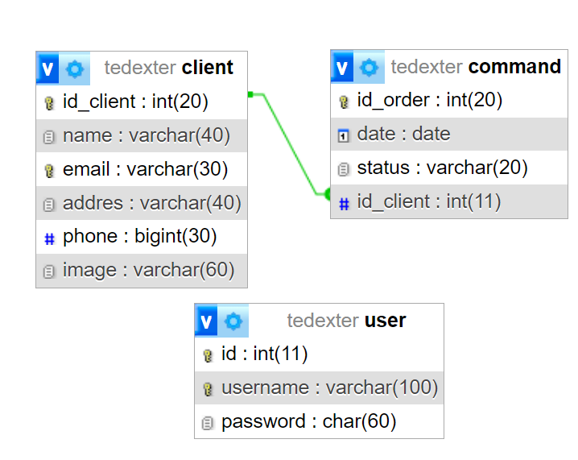

# Tedexter

## Alumnos 
Medina, Sebastián Federico (30513499) y Saganea, Giuliana Celeste (44534456).

## Breve introducción
Nuestro sitio web consiste en una tienda de ropa deportiva llamada "Tedexter", en el cual se administrarán las ventas en linea de dicha tienda. La base de datos que contiene posee dos tablas (Cliente/Pedidos), la relación de las tablas es de 1 a N (1 cliente puede tener N pedidos). 
En la tabla cliente tenemos los datos del mismo, Id_cliente, nombre, email, dirección, teléfono e imagen del mismo. Mientras que en la tabla Pedido se encuentran Id_Pedido, fecha del pedido, estado y como clave foránea el Id_cliente.

Se pueden acceder a los pedidos realizados por los clientes, cómo así editar los clientes y pedidos añadiendo, eliminando y modificando éstos mismos (éstas ultimas acciones sólo podran ser utilizadas por los usuarios logueados)

## Inicio de sesión
Para poder iniciar sesión y poder realizar las acciones solo permitidas para los usuarios logueados se necesitan los siguientes datos:

* Usuario: webadmin y contraseña: admin

## DER:

 

